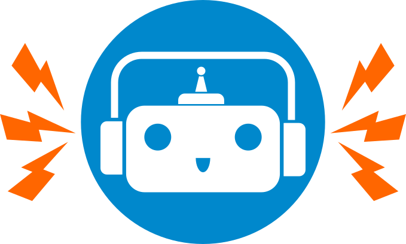
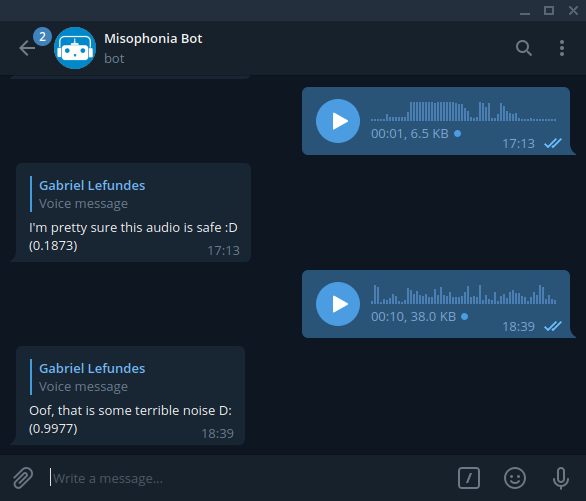

[![Heroku][heroku-shield]][deployment-url]
[![MIT License][license-shield]][license-url]
[![LinkedIn][linkedin-shield]][linkedin-url]

 

  

  <h3 align="center">Misophonia Bot</h3>

  

A telegram bot to help you figure out if voice and audio messages are safe-to-listen
     

<!-- TABLE OF CONTENTS -->
## Table of Contents
* [About the Project](#about-the-project)
	* [Built With](#built-with)
	* [How it works](#how-it-works)
* [Usage](#usage)
* [License](#license)
* [Contact](#contact)
* [Acknowledgements](#acknowledgements)

<!-- ABOUT THE PROJECT -->
## About The Project

    

[WebMB describes misophonia](https://www.webmd.com/mental-health/what-is-misophonia#1)  as *"(...) a disorder in which certain sounds trigger emotional or physiological responses that some might perceive as unreasonable given the circumstance. Those who have misophonia might describe it as when a sound 'drives you crazy.' "*

This bot aims to help people suffering from this condition judge whether or not a voice message or audio file is safe-to-listen. This all started as a joke between some friends, one of whom suffers from misophonia. Shout out to [@jvmcarneiro](https://github.com/jvmcarneiro) for the original idea.

----------

### Built With
* [Audio Class data annotation tool](https://github.com/glefundes/audio-class)
* [PyTorch/Torchaudio](https://pytorch.org/)
* [python-telegram-bot](https://github.com/python-telegram-bot/python-telegram-bot)

### How it works
**Misophonia Bot** listens to any audio or voice message you send him and gives you his best estimate on whether or not that message is safe to listen to.
Along with a verbal response with his recommendation, he gives you a score on a scale of 0 to 1 on where he thinks the message falls (with 0 being a clean message, and 1 being a very unsafe sound) so you can make your own judgement.

The brain of **Misophonia Bot** is a Recurrent Convolutional Neural Network trained on scrapped youtube videos and 1000+ manually annotated voice messages from telegram group chats. The model was inspired by [this repo](https://github.com/ksanjeevan/crnn-audio-classification) and the training code will be available soon.

Rest assured that no personal data is *ever* logged or stored by the bot.  You can verify that by checking the [source code](https://github.com/glefundes/misophonia-bot/blob/master/bot.py) yourself. 

**Misophonia Bot** is currently hosted for free on Heroku, so some delays in response can be expected should the demand rise.

<!-- GETTING STARTED -->
## Usage
Record or forward a voice message to [Misophonia Bot](https://t.me/misophonia_bot) and you'll get your response. It's that simple! :)

<!-- LICENSE -->
## License

Distributed under the MIT License. See `LICENSE` for more information.

<!-- CONTACT -->
## Contact

Gabriel Lefundes Vieira - lefundes.gabriel@gmail.com

<!-- ACKNOWLEDGEMENTS -->
## Acknowledgements

* [README Template](https://github.com/othneildrew/Best-README-Template)
* [CRNN for audio classification](https://github.com/ksanjeevan/crnn-audio-classification)
* [Skeleton for app deployment of python-telegram-bot on Heroku](https://github.com/Eldinnie/ptb-heroku-skeleton)

<!-- MARKDOWN LINKS & IMAGES -->
<!-- https://www.markdownguide.org/basic-syntax/#reference-style-links -->
[stars-shield]: https://img.shields.io/github/stars/github_username/repo.svg?style=flat-squarehttps://img.shields.io/appveyor/build/glefundes/misophonia-botz
[stars-url]: https://github.com/github_username/repo/stargazers

[license-shield]: https://img.shields.io/github/license/glefundes/misophonia-bot.svg?style=flat-square
[license-url]: https://github.com/glefundes/misophonia-bot/blob/master/LICENSE

[linkedin-shield]: https://img.shields.io/badge/-LinkedIn-black.svg?style=flat-square&logo=linkedin&colorB=555
[linkedin-url]: https://www.linkedin.com/in/glefundes/

[heroku-shield]:https://img.shields.io/badge/Heroku-deployed-blueviolet?style=flat-square&logo=heroku
[deployment-url]:https://github.com/glefundes/misophonia-bot/deployments
